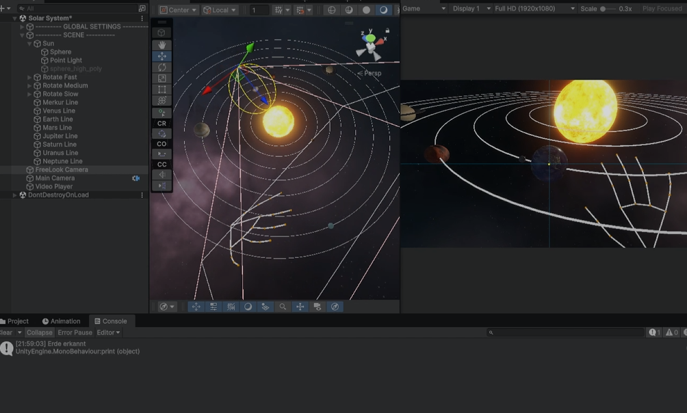
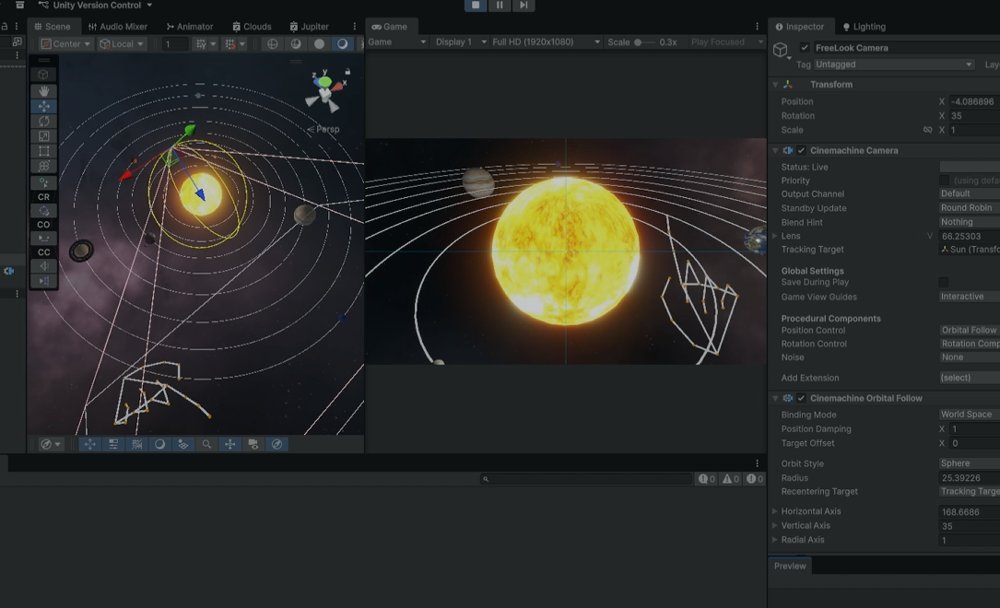
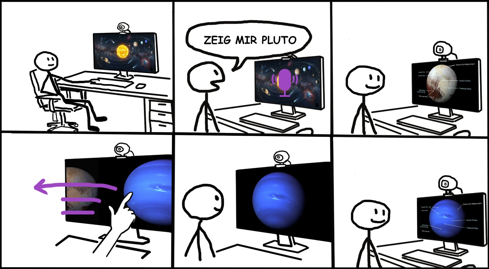

# Solar-System
[Demo-Video](Src/demo.mp4)
| | |
| --- | --- |
|  |  |

## Beschreibung
In diesem Projekt wird ein interaktives 3D-Modell unseres Sonnensystems in C# mithilfe des Frameworks Unity entwickelt. Die Besonderheit liegt in der multimodalen Mensch-Maschine-Interaktion: Nutzer können sich mithilfe von Gestensteuerung und Spracherkennung frei durch das System bewegen, Himmelskörper anwählen und Informationen abrufen. Durch die Kombination beider Eingabemodalitäten entsteht ein intuitives und natürliches Steuerungserlebnis, das die Erkundung des virtuellen Raums deutlich verbessert.

## AMITUDE-Modellierung
| Buchstabe | Bedeutung | Beschreibung |
| --- | --- | --- | 
| **A** | Application | Eine interaktive 3D-Sonnensystem Anwendung |  
| **M** | Modalities | Gestensteuerung für Bewegung, Sprachsteuerung für Planetenauswahl |
| **I** | Interaction | Nutzer bewegt sich durch Gesten und wählt Planeten mit Sprachbefehl aus |
| **T** | Task | Nutzer können sich frei bewegen und Planeten auswählen |
| **U** | User | Benutzer/in |
| **D** | Devices | Kamera für Gesten, Mikrofon für Sprache |
| **E** | Environment | Desktop-Rechner mit Kamera und Mikrofon |

## CROW-Framework
**Character:** 
Die aktiven Teilnehmenden in diesem Projekt sind Personen, die neugierig und explorativ sind, mit Interesse an Astronomie und der Erkundung des Weltraums. Sie treffen Entscheidungen aktiv, wählen Planeten aus, bewegen sich im Raum und entscheiden, welche Informationen abgerufen werden sollen. Ihre Eigenschaften umfassen Offenheit, Lernbereitschaft und Experimentierfreude, besonders beim Einsatz neuer Interaktionsformen wie Gestensteuerung und Sprachbefehlen.  

**Relationship:** 
Die Beziehungen bestehen zwischen den Teilnehmenden und den Himmelskörpern im virtuellen Sonnensystem. Die Planeten reagieren auf Eingaben – sei es durch Anvisieren via Gesten oder Auswahl per Sprachbefehl. Gleichzeitig entsteht eine Beziehung zur Umgebung selbst. Die Personen nehmen das System als immersiven Raum wahr, dessen physikalische Strukturen und Bewegungen (z.B. Umlaufbahnen, Rotation) realistisch simuliert werden. Diese Beziehungen sind dynamisch, interaktiv und ermöglichen eine direkte Rückkopplung auf die Handlungen der Teilnehmenden.  

**Objective:** 
Das Ziel der Teilnehmenden ist die aktive Erkundung des Sonnensystems, das Auffinden bestimmter Planeten oder Himmelskörper und das Abrufen von Informationen. Kurzfristig sollen Planeten fokussiert und navigiert werden, langfristig soll ein umfassendes Verständnis des virtuellen Sonnensystems entstehen. Die intuitive Steuerung durch Gesten und Sprache unterstützt die Immersion und erleichtert die Ineratkion.  

**Where:** 
Die Umgebung ist ein virtuelles 3D-Sonnensystem, das Sonne, Planeten, Asteroiden und weitere astronomische Objekte enthält. Die Bedingungen sind auf Desktop-Anwendungen ausgelegt, mit realistischen Skalierungen, Bewegungen, Lichtverhältnissen und noch zusätzlichen Easter eggs. Die Umgebung ist aktiv in die Interaktion eingebunden: Himmelskörper können ausgewählt werden, Umlaufbahnen und Rotationen beeinflussen die Bewegungsfreiheit der Teilnehmenden, und die virtuelle Szenerie reagiert auf die multimodale Steuerung.  

## Storyboarding

Das Storyboard illustriert explizit an einem Beispiel die multimodale Steuerung der Anwendung :

- **Voice Control:** Das System reagiert auf deutsche Sprachbefehle, um spezifische Himmelskörper anzuzeigen - "Zeig mir Pluto" (auch wenn Pluto kein Planet ist ).
- **Gesture Navigation:** Intuitive Steuerung durch Wischgesten und Handzeichen, um zwischen Planeten und Ansichten zu wechseln.
  

Mehr Informationen im [Projekt-Blog](https://bildungsportal.sachsen.de/opal/auth/RepositoryEntry/33154007041/BusinessGroup/51148128297/menu/MENU_SHOW_BLOG).
  

Bearbeiter: Jonas Thaun, Lazar Schmidt, Alexander Hellebrandt
